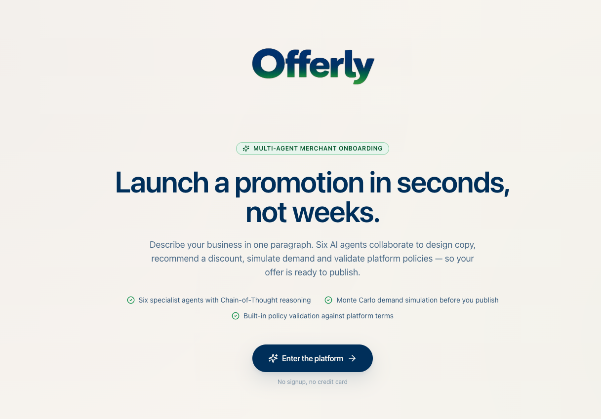
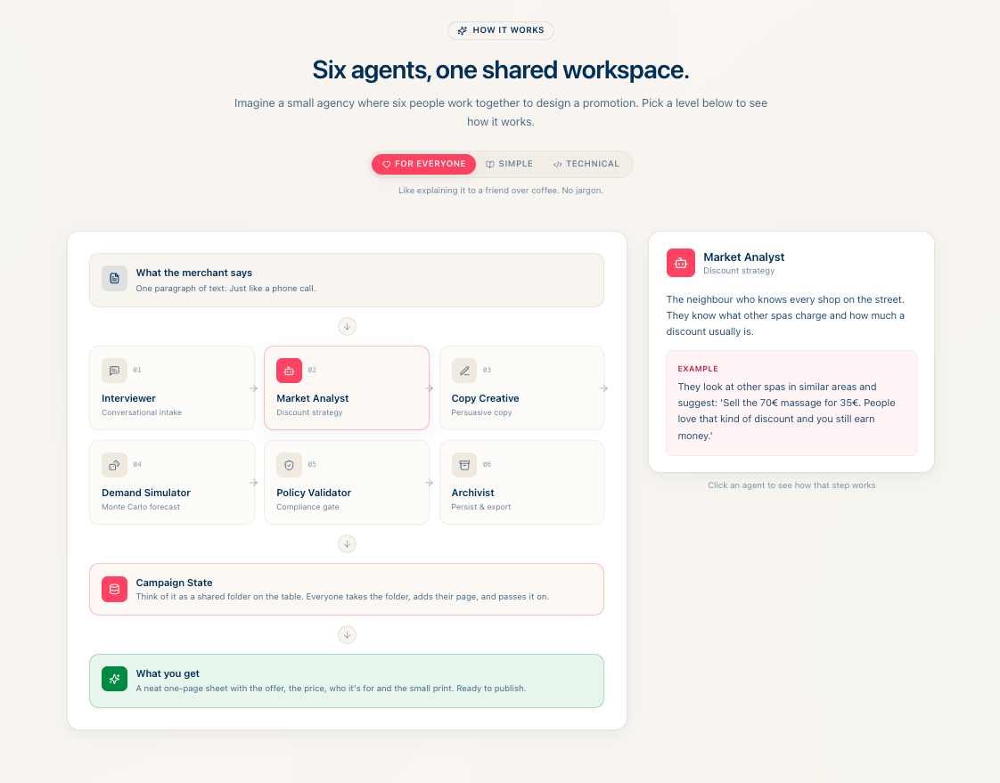
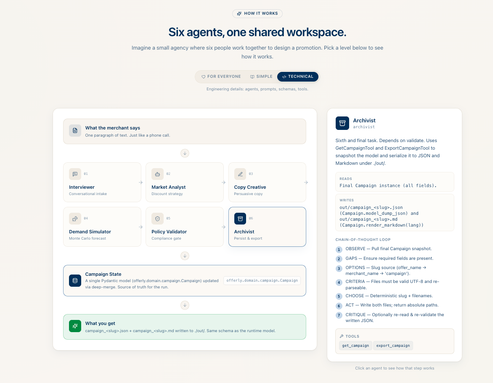
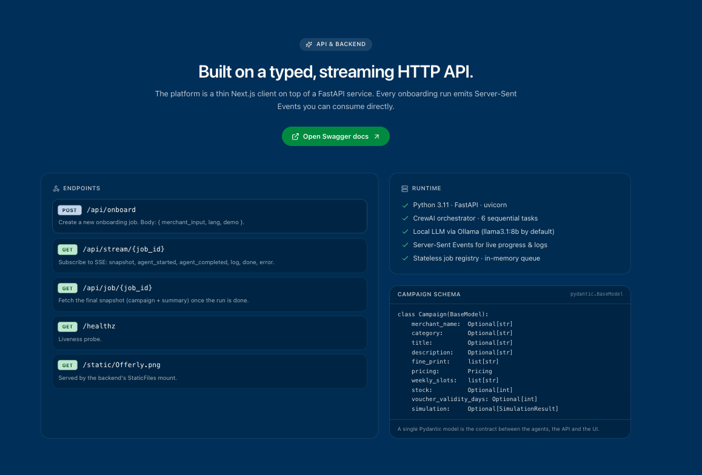
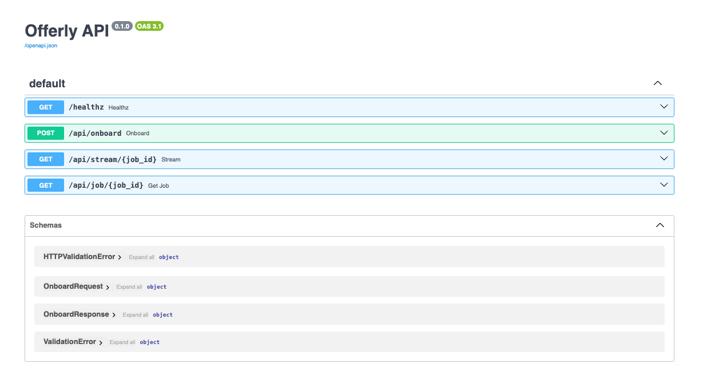
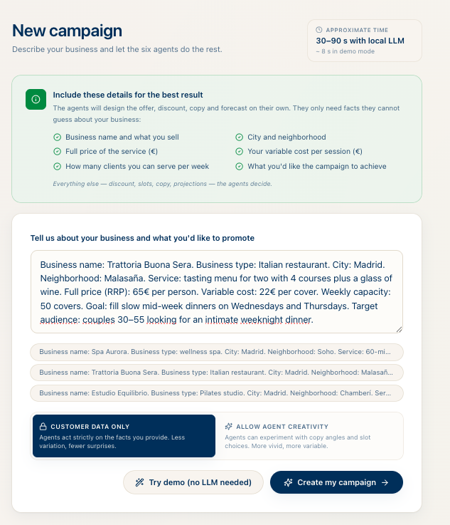
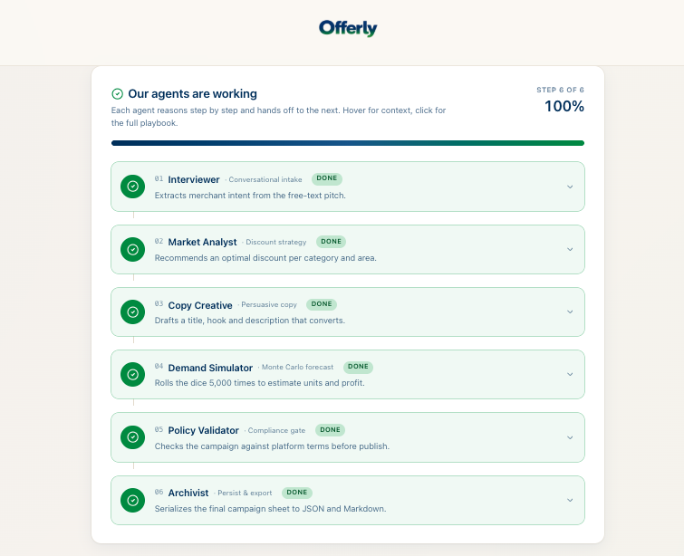
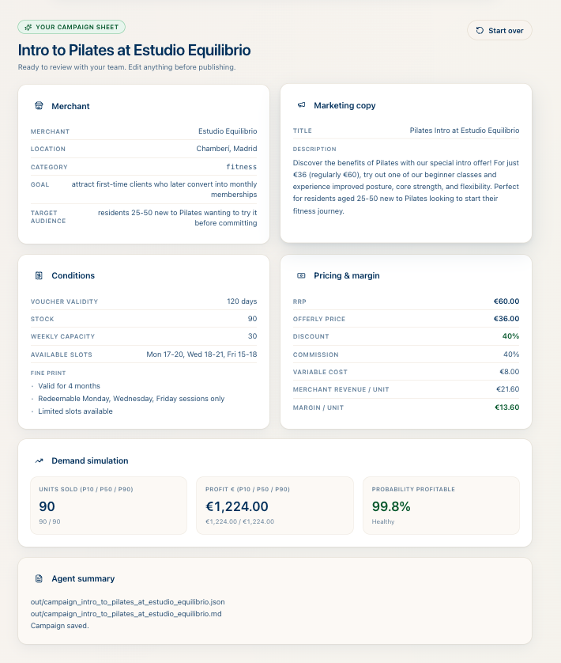
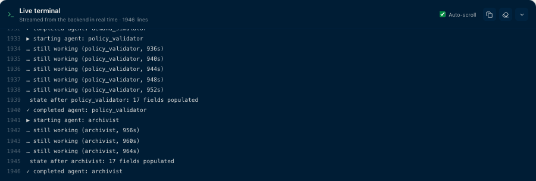

<p align="center">
  
</p>

<h1 align="center">Offerly</h1>

<p align="center">
  <b>Multi-Agent Chain-of-Thought · Merchant Onboarding</b><br/>
  Turn a one-paragraph merchant pitch into a ready-to-publish promotional campaign.
</p>

<p align="center">
  
  
  
  
  
  
  
  
  
  
</p>

---

## What it is

Offerly is a **multi-agent system** that automates merchant onboarding for a deals
platform. The merchant types a free-form description of their business and the
offer they want to launch. Six AI agents collaborate over a shared campaign
state and produce a complete, validated campaign sheet:

- Catches the merchant's intent and structures it.
- Recommends a discount and price based on category benchmarks.
- Writes the marketing copy.
- Runs a Monte Carlo demand simulation.
- Validates everything against platform policies.
- Exports the final sheet to JSON and Markdown.

Every agent reasons explicitly with a **Chain-of-Thought** scaffold and writes
to a single Pydantic-typed state object. Each writer agent is wrapped in a
CrewAI `Task` with a **guardrail** that re-prompts the agent if it didn't
persist its required fields (up to 2 retries).

> The CoT scaffold is wired into every agent backstory and task description
> via [`offerly/reasoning.py`](offerly/reasoning.py) and the i18n bundles —
> it ships with an empty suffix by default, but can be activated by filling
> `COT_BACKSTORY_SUFFIX` in [`offerly/i18n/en.py`](offerly/i18n/en.py) /
> [`es.py`](offerly/i18n/es.py) to inject explicit step-by-step reasoning
> into every agent.

Stack: **CrewAI + LiteLLM + Ollama** (local LLM, default `qwen2.5:14b`) on a
Python 3.11 backend served by **FastAPI** (Server-Sent Events for live
progress), with a **Next.js 15 + TypeScript + Tailwind** frontend.

---

## How it works

```
   ┌────────────────────────┐
   │  Merchant pitch (text) │
   └───────────┬────────────┘
               ▼
   ┌────────────────────────┐
   │ 01 · Interviewer       │  extracts merchant_name, category,
   │    → update_campaign   │  city, goal, audience, pricing inputs
   └───────────┬────────────┘
               ▼
   ┌────────────────────────┐
   │ 02 · Market Analyst    │  decides discount, offerly_price,
   │    → benchmarks        │  stock, voucher validity, weekly slots
   │    → update_campaign   │
   └───────────┬────────────┘
               ▼
   ┌────────────────────────┐
   │ 03 · Copywriter        │  writes title, description, fine print
   │    → update_campaign   │  (anchored to real merchant data)
   └───────────┬────────────┘
               ▼
   ┌────────────────────────┐
   │ 04 · Demand Simulator  │  Monte Carlo: units p10/p50/p90,
   │    → simulate_demand   │  profit forecast, probability profitable
   └───────────┬────────────┘
               ▼
   ┌────────────────────────┐
   │ 05 · Policy Validator  │  banned terms, margin floor,
   │    → validate_policies │  voucher window, stock cap
   └───────────┬────────────┘
               ▼
   ┌────────────────────────┐
   │ 06 · Archivist         │  campaign_<slug>.json + .md
   │    → export_campaign   │  to ./out/
   └────────────────────────┘
```

All six agents share a single Pydantic **Campaign** model. Guardrails verify the
shared state after each writer agent and trigger a re-prompt if a required
field is still empty. The frontend streams progress and tool calls live over
Server-Sent Events.

### RAG · Policy Validator

The **Policy Validator** is augmented with **Retrieval-Augmented Generation**
over [`docs/POLICIES.md`](docs/POLICIES.md). Before emitting its verdict, the
agent retrieves the most relevant clauses from a local **ChromaDB** index
embedded with **Ollama** (`nomic-embed-text`), then **cites the section it
applied** in the explanation. The deterministic `validate_policies` tool still
owns the numeric verdict — RAG only adds the narrative context. Build the
index once with:

```bash
ollama pull nomic-embed-text   # one-time, ~270 MB
make rag-index                 # chunks docs/POLICIES.md → .rag/chroma/
make test                      # end-to-end self-test of the RAG layer
```

Inside the Docker stack: `make docker-pull-model` (now pulls both the chat and
the embedding model) followed by `make docker-rag-index`.

---

## Screenshots

<details>
<summary><b>📸 Platform walkthrough — click to expand</b></summary>

<br/>

<table>
  <tr>
    <td align="center" width="50%">
      <a href="docs/screenshots/offerly-01.png"></a><br/>
      <sub><b>01 · Landing</b></sub>
    </td>
    <td align="center" width="50%">
      <a href="docs/screenshots/offerly-02.png"></a><br/>
      <sub><b>02 · How it works · For everyone</b></sub>
    </td>
  </tr>
  <tr>
    <td align="center">
      <a href="docs/screenshots/offerly-03.png"></a><br/>
      <sub><b>03 · How it works · Technical</b></sub>
    </td>
    <td align="center">
      <a href="docs/screenshots/offerly-04.png"></a><br/>
      <sub><b>04 · API &amp; Backend</b></sub>
    </td>
  </tr>
  <tr>
    <td align="center">
      <a href="docs/screenshots/offerly-05.png"></a><br/>
      <sub><b>05 · Swagger docs</b></sub>
    </td>
    <td align="center">
      <a href="docs/screenshots/offerly-06.png"></a><br/>
      <sub><b>06 · New campaign form</b></sub>
    </td>
  </tr>
  <tr>
    <td align="center">
      <a href="docs/screenshots/offerly-07.png"></a><br/>
      <sub><b>07 · Agents working (live SSE)</b></sub>
    </td>
    <td align="center">
      <a href="docs/screenshots/offerly-08.png"></a><br/>
      <sub><b>08 · Final campaign sheet</b></sub>
    </td>
  </tr>
  <tr>
    <td align="center" colspan="2">
      <a href="docs/screenshots/offerly-09.png"></a><br/>
      <sub><b>09 · Live backend terminal streamed to the UI</b></sub>
    </td>
  </tr>
</table>

</details>

---

## Quickstart

### Requirements

- Python 3.11+ and [`uv`](https://docs.astral.sh/uv/)
- Node 18+
- [Ollama](https://ollama.com) running locally

### 1. Pull the default models

```bash
ollama pull qwen2.5:14b          # chat model (~9 GB)
ollama pull nomic-embed-text     # embedding model used by RAG (~270 MB)
```

### 2. Install Python dependencies

```bash
uv sync
```

### 3. Install frontend dependencies (first time only)

```bash
cd frontend && npm install && cd ..
```

### 4. Build the RAG policy index (one-time)

```bash
make rag-index
```

### 5. Start everything (backend + frontend)

```bash
make dev
```

### 6. Open the platform

```bash
open http://localhost:3000
```

### Alternative — run the whole stack with Docker

If you don't want to install Python, Node or Ollama on the host, the stack is
fully dockerised. You only need **Docker Desktop** (or any engine with
`docker compose`).

```bash
# 1. Build images + start Ollama, backend (:8000) and frontend (:3000)
make docker-up

# 2. Pull the chat + embedding models into the Ollama volume (one-time)
make docker-pull-model

# 3. Build the RAG policy index inside the stack (one-time)
make docker-rag-index

# 4. Open the platform
open http://localhost:3000
```

Other Docker targets:

```bash
make docker-logs                       # tail logs from all services
make docker-ps                         # status of each container
make docker-down                       # stop stack (keep model volume)
make docker-clean                      # stop stack AND drop the model volume
OLLAMA_MODEL=llama3.1:8b make docker-up    # smaller / faster model
```

Pure-`docker compose` equivalents (no Make):

```bash
docker compose up -d --build                              # start
docker compose --profile pull run --rm ollama-pull        # pull model
docker compose logs -f                                    # logs
docker compose down                                       # stop
docker compose down -v                                    # stop + drop volumes
```

Port conflicts (e.g. you already have something on `:3000`)? Override with env
vars:

```bash
FRONTEND_PORT=3001 BACKEND_PORT=8001 OLLAMA_PORT=11435 docker compose up -d
```

> **Try it without the LLM:** the platform ships with a fully-working **demo
> mode** that replays a canned campaign. You can POST `{"demo": true}` to
> `/api/onboard` before pulling any model and watch the full 6-agent pipeline
> run in under 10 seconds.

### Alternative — run pieces separately

Start only the FastAPI backend (port 8000):

```bash
make web
```

Start only the Next.js frontend (port 3000):

```bash
make frontend
```

Run the legacy interactive CLI (no web UI):

```bash
make dev-cli
```

Smoke-test the pure-logic tools (no LLM required):

```bash
make smoke
```

End-to-end self-test of the **whole platform** (domain, tools, web layer,
demo mode, agent wiring and RAG retrieval) — runs in ~2 s, requires Ollama
for the RAG section:

```bash
make test
```

### Override the model

```bash
OLLAMA_MODEL=llama3.1:8b make dev
```

---

## Project structure

```
.
├── Makefile                       # dev / web / frontend / dev-cli / smoke / test / rag-index / docker-*
├── Dockerfile.backend             # uv + FastAPI image
├── docker-compose.yml             # ollama + backend + frontend + rag-index stack
├── pyproject.toml                 # python deps via uv (incl. chromadb)
├── docs/
│   ├── POLICIES.md                # source of truth for the RAG policy index
│   └── screenshots/               # platform screenshots
├── scripts/
│   └── selftest.py                # `make test` end-to-end self-test
├── offerly/                       # Python package
│   ├── cli.py                     # legacy conversational CLI
│   ├── crew.py                    # crew assembly entrypoint
│   ├── agents.py                  # 6 CrewAI agents + LiteLLM routing
│   ├── tasks.py                   # tasks + guardrails + retries
│   ├── reasoning.py               # CoT helper wrappers
│   ├── domain/
│   │   ├── campaign.py            # Pydantic Campaign model
│   │   ├── categories.py          # category benchmarks
│   │   └── policies.py            # numeric platform thresholds
│   ├── tools/
│   │   ├── campaign.py            # update_/get_/export_campaign
│   │   ├── benchmarks.py          # category_benchmarks tool
│   │   ├── demand.py              # Monte Carlo simulator
│   │   ├── policies.py            # validate_policies tool
│   │   └── rag_policies.py        # retrieve_policy_clauses (RAG)
│   ├── rag/                       # RAG layer (Ollama embeddings + ChromaDB)
│   │   ├── embeddings.py          # OllamaEmbeddingFunction
│   │   ├── store.py               # persistent Chroma client + collection
│   │   └── ingest.py              # `python -m offerly.rag.ingest`
│   ├── i18n/                      # EN + ES bundles
│   └── web/                       # FastAPI app
│       ├── app.py                 # endpoints + CORS + static
│       ├── jobs.py                # job registry + SSE format
│       ├── runner.py              # orchestrator + context wiring + fd capture
│       └── static/Offerly.png
├── frontend/                      # Next.js 15 + TS + Tailwind
│   ├── Dockerfile                 # multi-stage build for production image
│   └── src/
│       ├── app/{layout,page}.tsx
│       ├── components/*.tsx       # Navbar, Landing, PromptCard,
│       │                          # AgentTimeline, ResultPanel,
│       │                          # Console, HowItWorks, Pricing,
│       │                          # ApiSection, Contact, Footer …
│       └── lib/                   # i18n, types, format, useOnboarding
├── .rag/                          # ChromaDB persistent index (gitignored)
└── out/                           # campaign exports (gitignored)
```

---

## API endpoints

| Method | Path                       | Purpose |
|--------|----------------------------|---------|
| POST   | `/api/onboard`             | Create a new onboarding job. |
| GET    | `/api/stream/{job_id}`     | Server-Sent Events stream of progress + live logs. |
| GET    | `/api/job/{job_id}`        | Final snapshot once the run is done. |
| GET    | `/healthz`                 | Liveness probe. |
| GET    | `/docs`                    | Swagger UI generated by FastAPI. |

---

## Environment variables

| Variable               | Purpose                                             | Default                        |
|------------------------|-----------------------------------------------------|--------------------------------|
| `OLLAMA_MODEL`         | Chat model name (no prefix, runner adds `ollama_chat/`) | `qwen2.5:14b`              |
| `OLLAMA_EMBED_MODEL`   | Embedding model used by the RAG policy index        | `nomic-embed-text`             |
| `OLLAMA_BASE_URL`      | Ollama HTTP endpoint                                | `http://localhost:11434`       |
| `OFFERLY_RAG_DIR`      | Where ChromaDB persists the policy index            | `.rag/chroma`                  |
| `OFFERLY_LANG`         | Default language (`en` or `es`)                     | `en`                           |
| `OFFERLY_WEB_HOST`     | Backend host                                        | `127.0.0.1`                    |
| `OFFERLY_WEB_PORT`     | Backend port                                        | `8000`                         |
| `OFFERLY_WEB_RELOAD`   | uvicorn auto-reload (`1` to enable)                 | `0`                            |

